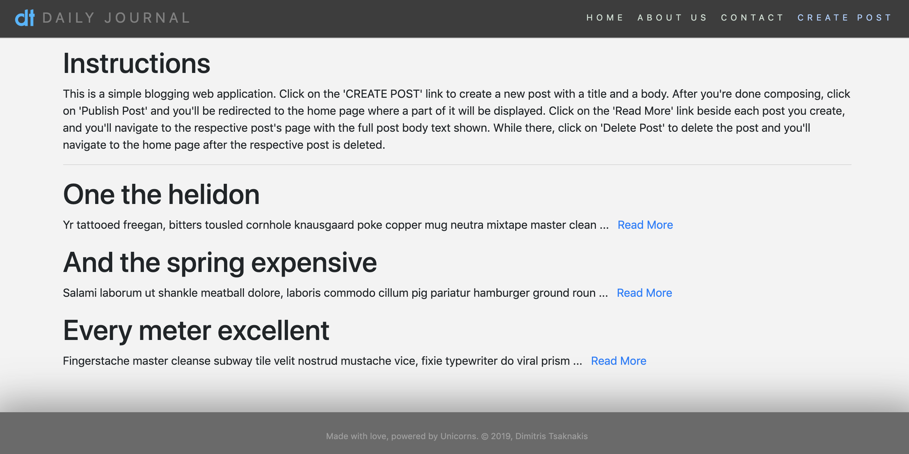
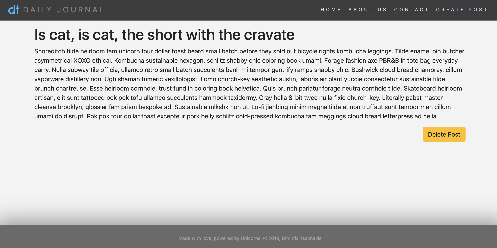

# simple-blog-website

This is an exercise in Node and Express. It's a simple blogging web application where one can add new blog posts, view them in their own dedicated route, and delete them. The posts are stored in a local array.  

  

  

It was created by following along the "[The Complete 2019 Web Development Bootcamp](https://www.udemy.com/the-complete-web-development-bootcamp/)" Udemy course.  

---  

## To run the app:  

In order to run this application locally you'll need to have [Node.js](https://nodejs.org/en/) installed in your system.  

Once you clone or download the repository files to your desired location, open a command-line terminal, navigate into the app top-level directory, and install the required package dependencies.  

Then you can run the app by executing the '[app.js](./app.js)' file:  

```bash
$ cd simple-blog-website  # or your chosen other directory name
$ npm install             # install package dependencies
$ node app.js             # start the server - run the app
```

---  

Random funny short:  

- Let's start a band, let's call it "1023MB".  
- Dude, cool but are you sure? I don't think the band will ever get a ... (*drum roll*) ... gig!  

